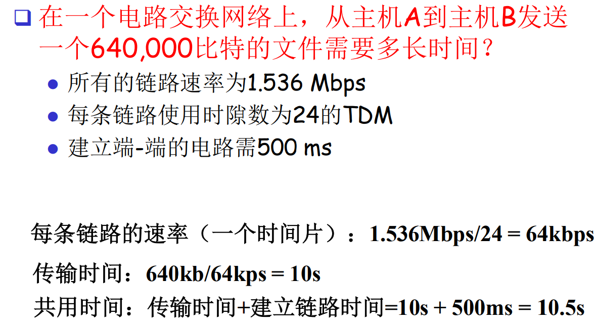
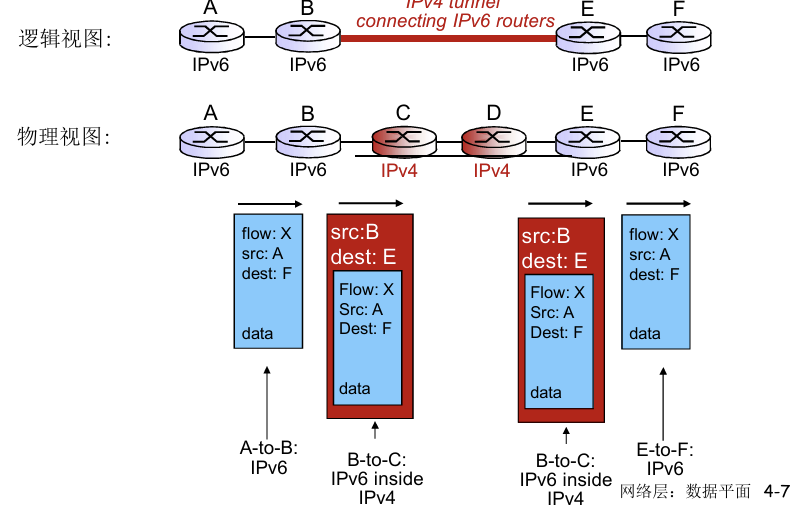
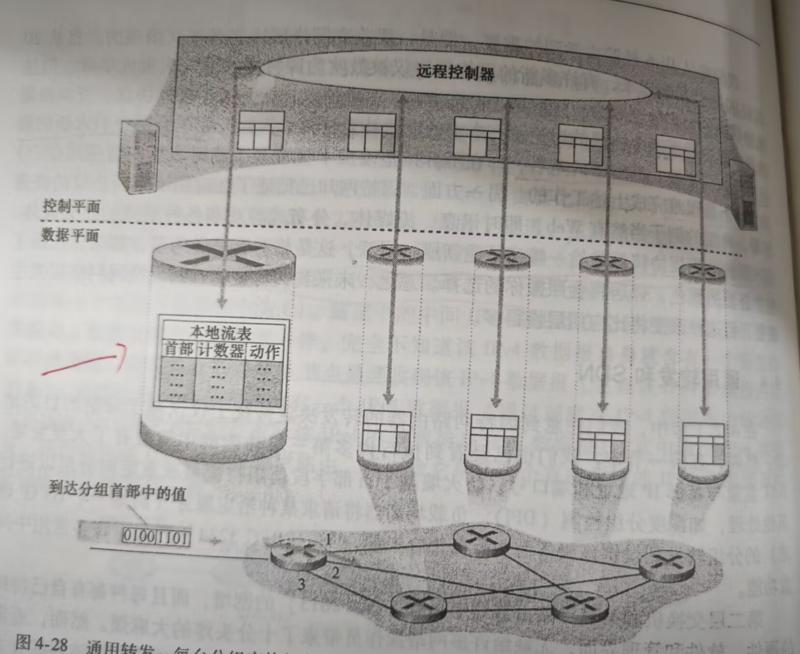
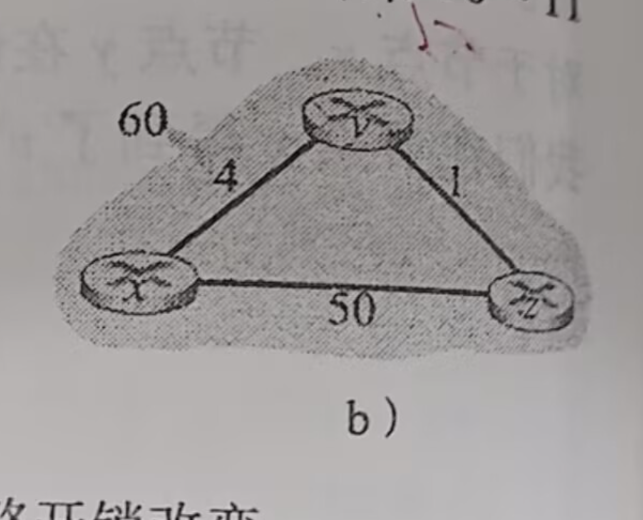

# 概述

## 什么是 internet

从具体构成看：节点——主机及其上所运行的程序(**源/目标节点**)和路由器交换机(**中转节点/数据交换节点**)；边——通信链路，如光纤、同轴电缆、无线电 、卫星；协议——定义了不同终端中**对等层的实体**(ip对ip，网卡对网卡)通信的**规范**，包括了**报文格式**和**次序**，以及处理请求的**动作**等。

简言之互联网是网络的网络，是很多个通过路由器连接起来的网络。

从服务的角度看：

+ 互联网是使用通信设施进行通信的**分布式应用**
+ 为app提供通信服务(编程接口)的**基础设施**，服务分为：无连接不可靠服务(UDP) 面向连接可靠服务(TCP)

从构成角度看，互联网分为**网络边缘，网络接入和网络核心(**数据交换)。

带宽：**单位时间内能传输的数据量**

## 网络边缘

网络边缘包括**主机(端系统)**和运行在**网络边缘上的应用**

应用有两种架构模式：

- **客户端服务器模式(c/s)**：客户发送请求，服务器响应请求。这种模式可扩展性比较差；一般随着请求载荷的增加，能力会不断下降，该模式达到阈值时会断崖式下降；维护服务器的成本比较高。
- **对等模式(peer-peer p2p)**：所有节点地位平等，即使客户端又是服务器，客户端可以向其他的客户端发送请求(向A请求一段，向B请求一段)，也可以给其他的客户端提供服务，但是通信延迟高，不好统一管理。

握手：**在数据传输之前做好准备**，表现为两个通信主机之间为**连接建立状态**。

## 网络核心

网络核心用于数据交换，是**路由器和高速链路组成的网络**。

数据交换有两种方式：

电路交换：在源主机和目标主机之间分配了线路，**独享资源保证性能**，如果呼叫没有数据发送则被分配的资源就会被**浪费**，**连接建立时间长**，通常被传统的电话网络采用。网络资源(带宽)被分为**片**，方式有**频分，时分**。

​	

计算机之间的通信具有**突发性**，如果使用电路交换则**浪费的片比较多**，即使这个呼叫没有数据传输，其所占据的片也**不能被别的呼叫使用。**

分组交换：传输时使用**全部**带宽，主机之间传输的数据被分为一个个**分组**，到达下一个节点先**全部存下来(防止共享)**然后再传输到下一个节点，**资源共享，按需使用**，**延迟高于电路交换**，存在**排队延迟**。

分组交换按**有无网络层的连接**分为**数据报网络和虚电报网络**，数据报网络：通信之前无需**建立起连接**，有数据就传输；每个分组都有目标主机的**完整地址，独立传送**；虚电路： 两个主机通信前建立起**连接**，每个分组按照**虚电路号**标识。

1. 电路交换——整个报文的比特流连续的从源点到达终点，类似于在一个管道中传输
2. 报文交换——整个报文先传送到相邻的节点，全部存储下来后，转发到下一个节点
3. 分组交换——单个分组先传送到相邻的节点，全部存储下来，转发到下一个节点

发送和接收算是一次延时，发送需要时间，接收也需要时间，但是它们是**同时进行**的，因此算**一次**时间。

如果到达速率**大于**链路的输出速率，分组将会**排队等待输出**，如果路由器的缓存**用完了**分组将会被**抛弃**

网络核心的关键功能：**路由**——**决定分组采用的源到目标的路径(通过路由算法)**；**转发**——**路由器根据转发表将收到的数据包转发到合适的下一个路由器或最终目的地**

## 接入网

接入网：住宅接入，单位接入，无线接入

### 住宅接入

modem： 将上网数据**调制**加载音频信号上，**在电话线上传输**，在局端将其中的数据**解调**出来；反之亦然。速率**低于56**kbps，不能**同时**上网和打电话。

digital subscriber line (DSL)：还是用电话线上网，可以**同时**电话和上网。

线缆网络：对有线电视信号线缆**双向改造**，**在不同频段传输不同信道的数据**。 **非对称**: 最高30Mbps的下行传输速率, 2 Mbps 上行传输速率。**线缆和光纤网络**将个家庭用户接入到 **ISP 路由器**， 各用户**共享**到线缆头端的接入网络

### 企业接入

### 无线接入

各无线端系统共享无线接入网络

​	

## 物理媒体

物理链路：**连接每个发送-接收对之间的物理媒体**(网线 光纤)，分为**导引型媒体**(有形)——信号沿着固体媒介被导引，非导引型媒体——信号自由传播

物理媒体包括：双绞线 (TP)——两根绝缘铜导线拧合，同轴电缆——两根同轴的铜导线，光纤和光缆——光脉冲，每个脉冲表示一个 bit，在玻璃纤维中传输，低误码率高速安全。

一种无形的物理媒体，无线链路是**开放空间传输电磁波，携带要传输的数据**，无需物理“线缆” 双向，容易受到环境影响——反射吸收干扰，类型有地面微波 ，LAN (e.g., WIFI)，wide-area (e.g., 蜂窝)，卫星。

## Internet结构和ISP

互联网的结构是**网络的网络**

ISP是**互联网服务提供商**，为用户提供上网接入服务的公司和组织，如中国移动，中国电信

端系统通过**接入到ISP**连接到互联网，ISP需要是**互联**的。

ISP提供者之间也会有合作和竞争

此外，ICP(内容提供商网络：百度，谷歌等)为了**减少接入ISP的成本并提供更好的服务**，会在全球范围内构建**自己的专网**(通过数据中心用线缆连接在一起，这些数据中心一般建立在**核心ISP附近**)。它们提供**网络内容或服务**，用户通过ISP接入互联网，访问由ICP提供的内容和服务。

第一层ISP(中心)，国家/国际覆盖，速率极高，**直接与其他第一层ISP相连**，与大量的第二层ISP和其他客户网相连

第二层ISP：更小些的 (通常是**区域性的**) ISP，与**一个或多个第一层**ISP连接，也可能与其他第二层ISP连接

第三层ISP与其他本地ISP：接入网 (与端系统最近)

**IXP**互联网交换点，不同的ISPs之间可以**直接交换数据**，**减少绕行和延时**，**节省带宽和成本**。

## 分组延时

分组延时由四部分组成：

+ 节点处理延时($d_{proc}$)：**检查bit级错误 检查分组首部和决定将分组导向何处**
+ 排队延时($d_{queue}$)：**在缓冲队列上等待转发的时间**
+ 传输延时($d_{trans}$)：**把数据送到链路上的时间——分组长度/分组带宽**
+ 传播延时($d_{prop}$)：**物理链路的长度/媒体中的传播速度**

Traceroute诊断程序：提供**从源端经过路由器到目标的延时测量**，沿着目的地路径向**每个路由**发送3个探测分组，路由器会**返回**一个分组 计算发送和回复之间的**时间间隔**

链路的队列缓冲区容量有限，当分组到达一个满的队列时，**该分组会丢失**，丢失的分组可能会被**前一个节点或源重传或者不传**

吞吐量：**在源和目标端之间传输的速率**端到端的吞吐量一般取路径上传播的**最小速率**

端到端的吞吐为min(Rs,Rc,R/10)

## 协议层次

计算机网络是一个复杂的系统，采用**层次化结构**有利于实现复杂的网络功能，各层之间相互独立，不用关心其他层次的内容。

分层思想被认为有害的地方：（1）每一层可能冗余较低层的功能(错误检测，传输层和链路层都涉及到了)，（2）效率低下——每层之间传输数据需要封装和解封装

Internet协议栈

+ 应用层：直接面向用户为用户提供各种网络应用服务。
+ 传输层：**为进程之间的通信提供服务**
+ 网络层：**主机之间的数据传输，将数据报传输到目标所在的子网 ** 
+ 链路层：**相邻网络节点之间的数据传输**
+ 物理层：在线路上传输bit

IOS/OSI模型多出了两层，表示层：**数据格式转换，解密，压缩**，会话层：**建立，管理会话**，这两层可以被放到应用层中，一般用的都是internet协议栈

数据从**发送端的协议栈向下，沿着中间的链路层交换机和路由器协议栈上上下下，然后向上到达接收端系统的协议栈**

注意这里的链路层交换器只实现了第一和第二层，**没有网络层不能识别IP** 除非是三层的链路层交换机

各层次的协议数据单元

## 网络攻击

+ 植入有害程序 
+ 拒绝服务攻击 类似于大量的请求
+ 嗅探分组 窃取敏感信息
+ IP哄骗 伪装称你认识的人

# 应用层

主机由**IP**标识(一个IP可以标识**多个**主机)，主机中的进程由**端口**标识

## 进程

进程是在**主机上运行的程序**，进程在同一主机内使用**进程间通信机制(操作系统定义)**来通信，在不同主机间通过**交换报文**实现通信。

进程可以分为客户端进程——**发起通信**，和服务端进程——**等待连接**

套接字是对网络中不同主机上的应用进程之间进行通信的抽象，进程通过**套接字**socket发送报文和接收报文，一个进程会有**多个套接字**——套接字可以对应进程中的**一个线程(轻量级进程)**。

## 传输层提供的服务

传输层的服务大体分为四类：**可靠数据传输，吞吐量，定时，安全性**

TCP可靠的传输服务——**流量控制**:发送方不会淹没接收方，**面向连接**，**拥塞控制**:当网络出现拥塞时能够抑制发送方

UDP无连接的传输服务会丢失数据**但比较快**

注意UDP和TCP都没有**加密**，所以网络层是**不提供加密**的，加密是通过**SSL**(安全套接字层)在**应用层**上实现的，是对TCP的**强化**

两种协议都不提供**吞吐量和定时**的服务，注意服务中的安全性指的是**数据完整不丢失**

​													

## web和HTTP

web的应用层协议是**HTTP(用TCP作为运输协议)**，客户从套接字接口发送HTTP请求报文，并接受响应报文，服务器从套接字接口接收请求报文并返回响应报文。注意服务器不保存**关于客户的任何信息**，HTTP是**无状态协议**。

HTTP分为**非持续连接** ——每个请求响应经过**一个单独**的TCP连接 每个TCP在服务器**传输完数据后会关闭**，**持续连接**——所有的请求响应经过**同一个**TCP连接。

定义**RTT**为从客户出发再返回回来的时间，从服务器请求一个数据所需的时间为**2RTT(先进行一次握手，再搬运数据)+数据传输时间**，一个RTT用于建立连接，一个用于请求和接收对象。

假设有十个对象那么非持续连接=10RTT+10RTT+10数据传输时间，持续性连接=1RTT+10RTT+10数据运输时间

HTTP请求格式

第一行是请求行(方法，URL，HTTP版本)，其后继是请求头，每行**以回车和换行结尾**，最后一行再附加一个回车和换行用于和请求体隔离开

HTTP响应格式同理

web页是由**对象(文件)**组成的，比如html文件 ，媒体文件，图片之类的，这些对象都可以通过**URL(**uniform resource location，由**存放对象的主机名和对象的路径名**组成)寻址，多数web页面包括一个**基本的HTML文件**，这个基本的HTML文件**通过URL引用页面中的其他对象**，

##  Cookie和Session

Cookie是服务器发送到用户浏览器并保存在本地的一小块数据，用于维护无状态HTTP协议下的会话状态。

Session存在服务器端，是识别和管理特定用户会话状态的数据结构，Cookie和Session之间使用SessionID交互。

用户在第一次请求服务器的时候，服务器根据用户提交的相关信息，创建对应的session，请求返回时将次session的唯一标识信息SessionID返回给浏览器，浏览器接收到服务器返回的SessionID信息后，会将次信息存入Cookie中，同时cookie记录SessionID属于哪个域名。

在第二次访问服务器时，请求会自动判断域名下是否存在Cookie信息，如存在则自动将Cookie信息也发送给服务器端，服务器端会根据SessionID查找对应的Session信息，如果没有找到说明用户没有登录或登录失效。

## 电子邮件

SMTP(简单邮件传输协议)，用于在计算机之间传输电子邮件，使用25号端口，传输层协议是**TCP**，负责在客户端和邮件服务器，或在不同的邮件服务器之间**发送邮件和转发邮件**，SMTP只负责**发送和转发**，接收邮件通常使用**POP3**进行。

## DNS (Domain Name System)

将域名和IP地址相互映射的分布式数据库，**用于将主机名转换为IP地址**，使用80端口。

转换的过程中，本机一定要先知道本地DNS服务器的**IP地址**，一般是由网关分配（DHCP）

DNS采用分级查询，每个域名如`math.stackexchange.com`，会显示为`math.stackexchange.com.` 这是因为省略了域名的根域名，完整的域名应该是`math.stackexchange.com.root`，根域名的下一级叫做顶级域名top-level domain，缩写为TLD）如`.com`，下一级叫次级域名(SLD)，再下一级是主机名如`www`

DNS解析有递归和迭代两种：

+ 递归：发送请求后等待返回结果
+ 迭代：当根域名服务器收到本地域名服务器发出的迭代查询请求报文时，要么给出所要查询的IP地址，要么告诉本地服务器：“你下一步应当向哪一个域名服务器进行查询”。然后本地域名服务器再进行查询。

DNS解析过程

1. 用户在浏览器键入example.com，向本地域名服务器发送查询请求，若本地域名服务器存在缓存的解析数据，则直接将域名对应的IP地址返回
2. 本地域名服务器向根域名服务器进行查询
3. 根域名服务器将.com顶级域名服务器的地址返回给本地域名服务器
4. 本地域名服务器向.com顶级域名服务器发起example.com的查询请求
5. .com顶级域名服务器将为example.com提供权威解析的权威域名服务器地址，返回给本地域名服务器。
6. 本地域名服务器向权威域名服务器（返回最终的IP地址）发起查询请求。
7. 权威域名服务器将域名example.com对应的IP地址，返回给本地域名服务器。

8. 本地域名服务器最后把查询的IP地址响应给Web浏览器。

## 文件分发时间

从**一台**服务器分发文件(大小为F)到**N个对等体**需要的时间,U表示上传速度，d表示下载速度

在C/S架构下，**D=max(NF/Us,F/min(d))**就是服务器**传输完N个文件**和**最慢的对等体下载完文件**的时间的最大值，所需时间线性增长

在P2P架构下，**D=max(F/Us,F/min(d),NF/(Us+sum(u)))**，**服务器至少需要上传一个文件**，**所有客户端同时帮助上传所有文件**

## CDN(内容分发网络)

HTTP对多媒体文件提供的服务有**严重缺陷**，即所有客户接收到**相同编码**的视频，尽管对不同用户或者相同用户不同时间而言，可用的带宽大小有很大的不同。

为此研发了一种经HTTP的动态适应流**DASH**，在DASH中视频编码被分为几个**不同的版本**，其中每个版本有不同的**比特率**，对应不同的**质量水平**，客户**动态地**请求来自**不同版本**且长度为几秒的**视频段数据块**。

服务器：**视频被分为多个块，每个块独立存储，有不同的码率，还有一个告示文件提供块的URL**。

客户端：**首先请求该告示文件**，然后**周期性的测量带宽**，查询告示文件，在**一个时刻请求一个块**，**HTTP头部指定字节范围**，**在会话的不同时刻可以切换请求不同的编码块。**

客户端可以自适应决定**什么时候**去请求块，请求**什么码率**的块，**去哪里**请求

内容分发网是将网站内容分发到离用户最近的服务器上，从而加速访问的技术。

假设你的网站在北京服务器，但有用户在新加坡、巴黎、洛杉矶访问你的图片资源：

- 没CDN：他们都得“横跨全球”访问北京的数据中心；
- 有CDN：他们就近从本地新加坡、法国、美国的CDN节点直接拿到缓存内容！

当用户请求资源时，会先判断边缘节点是否有缓存改内容，如果有直接返回；反之，去源站拉取，缓存后再返回给用户。

## 网络字节序

大端和小端，表示多字节值的哪一端储存在**起始地址处**，大端：**最高有效位储存在起始地址**，小端：**最低有效位储存在起始地址**。

网络上传输的数据都是**字节流**，在进行传输时会**先传输哪个字节**？**接收到的字节是作为高位还是低位**？

UDP/TCP/IP协议规定：**把接收到的第一个字节当作高位字节看待**，因此发送端需要**先发送高位字节**，而发送是从**起始地址**开始的，因此**网络字节序是大端字节序**

每台计算机的**主机字节序各不相同**(由CPU架构决定)，因此在网络通信中需要将**主机字节序转化为网络字节序**，接收方**再转换回主机字节序。**

# 传输层

## 多路复用和多路分解

套接字是应用层和传输层之间的编程接口

- 多路分解：**将运输层报文段中的数据交付给正确的套接字的工作**
- 多路复用：在源主机从不同的套接字中收集数据块，并为每个数据块封装上首部信息从而生成报文段，然后将报文段传递给网络层

传输层接收到数据时，它需要将数据定向到对应的进程上。接收主机的运输层实际上并没有将数据**直接交付给进程**而是将数据交付给了一个**中间的套接字**，在任意时刻接收主机上可能不只有一个套接字，所以每个套接字有**唯一**的标识符，标识符的格式取决于所用的**运输层协议**。

UDP的套接字由一个**二元组**标识的，包括一个**目的端口**和一个**目的IP**，如果两个报文段的**源IP和源端口不同**但是**目的IP和目的端口**相同，那么这两个报文端将通过**相同的目的套接字**被定向到相同的进程。**源端口号用作“返回地址的一部分”**，当接收方需要回发一个报文段给发送方时，会从**源端口号中取值作为目的端口号**。

TCP的套接字由一个**四元组**标识的，**源IP 源端口 目的IP 目的端口**，只要有**一个不同**就会对应到**不同的套接字**。

客户端会让**运输层自动分配**端口号，而服务器则是分配一个**特定**的端口号，端口号中前**1024**是被保留的

## UDP

**数据交付和差错检查**是**最低限度**的运输层服务，也是UDP**仅有**的服务。

尽力而为的服务：报文段可能**丢失，乱序**，无连接：不会进行**握手**，每个UDP报文段**独立**地处理，**DNS 流媒体**使用UDP传输。

UDP存在的理由：**不建立连接，简单报文段头部很小，无拥塞控制和流量控制**

UDP检验和：发送方将**伪首部，头部和数据(检验和字段排除)**部分按**16位**分组，不足16位则**末尾补0**，将这些分组**相加**，如果有**溢出**要进行**回卷（把1加到末尾）**，最后将结果**按位取反**放到报文段头部的检验和字段。接收端收到数据后做**同样的运算**，如果计算出的结果与检验和字段**相加全为1**，则检验通过(也可以取反和检验和一一比较)

## 可靠数据传输(rdt)

这里的一个假设是**分组将以它们发送的次序进行交付(底层信道不会对分组重新排序)，某些分组可能会丢失**。

这里将模型用**有限状态机(fsm)**标来描述发送方和接收方

### 具备完全可靠信道——rdt1.0

这是最简单的情况，即底层信道是**完全可靠**的，没有**比特错误**和**分组丢失**

​	

发送方只通过**rdt_send():被上层（如应用层） 调用，以将数据交付给下方的发送实体**，经过**make_pkt(data)产生分组**，然后**udt_send():被rdt调用，用以将分组放到不可靠的信道上传输到接收方**。

接收方只通过**rdt_rev(packet)**事件**从底层信道接收一个分组**，从分组中经由**extract(packet,data)动作取出数据**，并通过**deliver_data(data)**将数据上传给较高层。

有了完全可靠的信道，接收端就不需要**发送任何反馈信息**给发送端

### 具有比特差错信道——rdt2.0

底层信道中的分组**可能受损**

当报文的接收者在收到了**受损的分组**后会要求发送者**重传报文**，基于这种重传机制的可靠数据传输协议称为**自动重传协议**(ARQ)

在ARQ中还需要**差错检测，接收方反馈(返回一个比特的分组信息标识)，重传**三种协议功能来处理比特差错

rdt2.0被称为**停止等待协议**：发送方发送一个分组，然后等待接收方回答

这里发送方的分组中会带有**检验和**，发送方在发送数据后会等待接收方的回复，如果收到**NAK(错误)**就**重传分组继续等待**，如果收到**ACK(正确)**则**不会执行动作**

接收方收到分组后，如果检测到**错误**则发送一个**NAK**给发送方然后**继续等待分组**，正确则将数据发送给信道然后继续等待。

然而rdt2.0没有考虑到**NAK和ACK可能会受损的情况**，如果这两个数据受损，则发送方不知道接收方是否正确接受了分组。一个可能的解决方案是，如果发送方收到了受损的NAK或ACK，那就**重新传输当前的分组**，但是这种方法在发送方和接收方的信道中引入了**冗余分组**，即接收方**不知道发送方是否收到了ACK.NAK**，这使得接收方无法判断**当前收到的分组是上次的还是新的**。

rdt2.1在此基础上一个简单的方法是**在数据分组中增加一个新字段**，让发送方对数据分组**编号**，接收方只需**检查序号**即可确定收到的分组是否是一次重传。序号只需要**0和1**就足够了，**收到重复的分组直接丢弃并发送ACK，符合要求也会返回ACK**，反之，返回NAK。

发送方收到ACK就继续发送下一个，收到NAK或受损的ACK/NAK**重传**

rdt2.2 **给ACK编号**，不再需要NAK，接收方收到正确的分组返回的ACK带该分组的编号，反之返回的相反编号的ACK，重复的分组丢弃

发送方收到的ACK出错就重传

### 具有比特级差错的丢包信道——rdt3.0

该协议下，**发送方**负责**检测**和**恢复**丢包工作，通过**倒计数定时器**，至少等待发送和和接收方之间的**一个往返时延**加上接收方**处理一个分组所需的时间**，如果发送方在规定的时间内**没有收到ACK**，则**重传分组**，即使ACK并不是丢失而是**延迟**了。

长时间没有收到ACK则重发分组

由于返回的ACK丢失了，发送方会进行重传，而接受方收到**冗余的分组**，接收方会**直接丢失冗余**的分组，但还是会**发送一个对应ACK**     

由于返回的**ACK延迟**，发送方重新发送分组，这会导致**多个ACK**返回，当接收到第一个ACK后发送方开始发送**下一个分组**，当收到了之前的ACK时，发送方会忽略该ACK**(什么都不做**)

rdt3.0的性能很差

在R=1Gbps(注意这里是速度单位，Gbps=$10^9$b/s)的链路，15ms端-端传播延时(RTT=30ms)，分组大小L=1kB(8000b)时，发送时间(发送后到接收到ACK所需时间)等于=**RTT+L/R**，而发送方实际将比特送到信道中的时间是**L/R**，实际的**利用率U**很低，这里假设ACK很小。

瓶颈在于**网络协议限制了物理资源的利用**

## 流水线可靠数据传输协议

**不以停等方式运行，允许发送方发送多个分组而无需等待确认**。

瓶颈转移为**链路带宽**

流水线要求：

+ 必须增加**序号的范围**
+ 在发送发和接收方要有**缓冲区**，用于缓存分组

两种通用的流水线协议是**回退N步和选择重传**

### 回退N步(GBN)

GBN将可用信号范围划分为四段，基序号base指向**第一个已发送但未确认的分组**

发送方：

+ 当上层调用rdt_sent()时，发送方会先检查发送窗口是否已满(有N个已发送但未确认的分组)，如果未满则产生一个分组并发送并相应地更新变量，反之发送方会将数据返回给上层，隐式地指示上层窗口已满
+ 收到一个ACK采用**累计确认**的方式，表示接受方已正确接收**n以及n之前的分组**
+ 发生超时或者丢失，则发送方**重传所有已发送但未被确认过的分组**，会对**第一个**已发送但未确认的分组设置**计时器**。
+ 收到老分组的**重复确认**，无动作，
+ 收到**乱序**的确认号，忽略

接收方：

+ 接收方窗口大小**等于**1

+ 如果一个序号为n的分组正确收到，并且**按序**(即上次交付给上层的数据是序号为n-1的)，那么接收方为分组n**发送一个ACK并将该分组传递该上层** 。
+ 收到**乱序**分组，接收方会**丢失**该分组，**并为最近按序接收到分组发送ACK**。即发送**累计确认**

### 选择重传(SR)

发送方

+ 从上方接收到数据后，检查下一个可用的分组序号，如果该序号位于发送方的窗口内则发送数据，反之要么将数据缓存要么返回给上层
+ 每个分组必须有自己的**定时器**，超时了只会重发**当前这个分组**
+ 当收到一个ACK时，如果分组序号**在窗口内**则将被确认的分组标记为**已接收**，如果该分组序号是**send_base**，**则窗口会前移直到send_base未确认(即从头开始连续的)**，**并发送新的分组**

接收方

+ 接收方窗口**大于**1

+ 可以**乱序**接收，收到的分组落在窗口内则**返回一个ACK**，对每个分组单独确认。一旦**从头开始的窗口连续了**就将这段连续的分组**返回给上层**，然后**移动窗口**，因此会**按序**上交分组
+ 如果收到的分组在窗口之前，也会返回一个ACK
+ 其他情况，忽略分组

然而这种方式有时会**无法确认发送的分组是上次的还是这次的**

### 比较

出错率低：比较适合**GBN**，出错非常罕见，没有必要用复杂的SR

链路容量大（延迟大、带宽大）：比较适合SR而不 是GBN，**一点出错代价太大**

### 窗口的最大尺寸

GBN：$2^n-1$

SR：$2^{n-1}$

## TCP

TCP被称为**面向连接的**，即两个进程开始发送数据之前必须相互发送某些预备报文段。

TCP只在**端系统**中运行，**所有的中间网络元素不会维持TCP连接状态，**事实上中间路由器对TCP连接完全**视而不见**，它们看到的是**数据报**而不是连接。

TCP是**全双工服务**，应用层数据在从进程B流向进程A的时候，也能从进程A流向进程B

TCP连接是**一对一**的，不可能出现一个发送方将数据传送给多个接收方，两台主机是一对。

一旦建立起一个TCP连接，两个应用进程之间就可以相互发送数据了，客户进程通过套接字传递数据流，数据一旦通过套接字，它就由进程中的TCP控制了，TCP将数据引导至发送方的缓存中，接下来TCP会不时的从发送缓存中取出一块数据并将数据传递到网络层，在另一端TCP将报文段的数据放入接收缓存中，然后应用进程从缓存中读取数据。

### TCP连接管理

当两个进程想建立连接时，客户的应用进程首先会通知客户TCP，然后客户TCP进行以下三步与服务器TCP建立连接

+ 客户端的TCP首先向服务器的TCP发送一个特殊的TCP报文段，该报文段**不包括应用层数据**，报文段首部的一个标志位**SYN被置为1**，然后**随机初始化一个序号**，最终将报文段**封装到IP数据报**中送到服务器TCP
+ 服务器TCP收到数据报后，为TCP连接**分配变量和缓存**，然后返回一个确认报文(SYNACK)，其中也**不会携带应用层数据**，确认报文中**SYN也被置为1**，**确认号设置为客户端序号+1**，然后再**随机初始化一个序号**。
+ 客户端收到SYNACK后，**分配连接的变量和缓存**，然后**返回一个确认报文段**，其中**SYN为0**，因为连接已经建立，这里的报文段**可以携带数据**

ack返回的值是希望得到的序列

三次握手：防止已经失效的连接请求突然传送到了服务端，因而产生错误。这里已失效的连接请求指的是client发送的第一个连接请求并没有丢失，而是在延误了一段时间后才到达server，而服务器收到了这个报文后，如果不采用三次握手会认为连接请求建立了，然后一直等待client发送信息，导致资源浪费。

结束连接：发送方会发送一个**FIN置为1**的报文段，接收方收到后**返回确认报文段**，然后接收方发送自己的**终止报文段**(FIN为1)，发送方收到后会发送一个**确认报文**，再等待一段时间才会关闭，一般是两个生命周期长度，防止返回的ACK丢失。

这里等待一段时间是为了防止服务器没有收到ACK报文，而重发Fin报文。	

四次挥手的原因：服务器接收客户端的中断请求时可能还有一些数据没有**发送完毕**，这时会先回复ACK表示收到了断开连接的请求，等到数据发送完之后再发Fin，断开服务器到客户端的数据传送。

### 报文段结构

TCP报文段结构由**首部字段**和一个**数据字段**组成，数据字段和首部字段不是对齐的。

TCP从**缓存中取出放入报文段中的数据数量**受限于**MSS**(最大报文段长度)  ，当TCP发送一个大文件时，通常将该文件划分为**长度为MSS的若干块**。MSS通常根据最初确定的由本地发送主机发送的**最大链路层帧长度MTU**来设置，设置MSS需要保证**MSS+TCP报文段首部(一般是40字节)不超过MTU**。

TCP把数据看作是一个**无结构的，有序的**字节流。一个报文段的**序号**是该报文段**首字节的字节流编号**，假定数据流由一个500,000字节的文件组成，其MSS为1000字节，则TCP将为数据流构建500个报文段，给第一个报文段编号0，第二个报文段编号1000，第三个报文段编号2000....，注意TCP连接双方均可**随机选择**初始序号，并不是一定从0开始。

确认号——主机A填充到主机B的确认号是**主机A期待从主机B收到的下一字节的序号**

初始时，主机A有序号42 主机B有序号79，在TCP建立连接后但还没有发送数据前，主机A等到字节79，主机B等待字节42，因此第一个报文段的确认号是79；主机B在收到报文段42后，下一次期待收到43，因此发送的报文段中的确认号是43；主机A收到79后，期待下次收到80，因此报文段中的确认号将会是80.

### 往返时间的估计与超时

报文段的**样本RTT(SampelRTT)**是**从报文段被发送到接收到对该报文段的的确认**之间的时间量。大多数TCP实现仅在某个时刻**做一次**SampleRTT测量，而不是**为每个**发送的报文段测量一个SampleRTT，且绝不会为重传的报文段测量SampleRTT。

由于路由器的拥塞和端系统负载的变化，SampleRTT会随之**波动**，为了估计一个典型的RTT，TCP会维持一个SampleRTT的均值**EstimatedRTT**，一旦获得一个**新的SampleRTT**，TCP就会根据`EstimatedRTT= (1-a)*EstimatedRTT+ a*SampleRTT`**重新估算**EstimatedRTT.

除了估算RTT外，测量RTT的**变化**也是有价值的，定义**DevRTT**用于估算SampleRTT偏离EstimatedRTT的程度

`DevRTT= (1-B)*DevRTT+ B*|SampleRTT-EstimatedRTT|`

TCP的超时时间间隔一般设置为**TimeoutInterval = EstimatedRTT + 4*DevRTT**，出现超时后，TimeoutInterval将**加倍**

###  可靠数据传输协议

TCP中只有**一个定时器**

发送方事件：

+ 从上层应用程序接收数据，将数据封装到报文段中，并将报文段交给IP，如果该报文段是**最早未被确**认的报文段，则开启定时器。
+ 一旦超时，则重传**引起超时的报文段(一个)**，然后**重启定时器**
+ 收到确认报文段后，将**ACK与sendbase**(最早未被确认)比较，TCP采用**累积确认**，如果y>sendbase，则说明y即y之前的都已经收到了，然后**更新**sendbase值，并为未确认的报文段**重启定时器**。因为采取累积确认所以即使前面返回的确认报文丢失了，但只要**有后面的确认报文到达**，就不会引起重传。

接收方会**丢失重复的报文段**，并发送ACK，这里的ACK是期待收到的下一个字节的序列号，而不**是重复报文段的序列号**。

TCP连接中收到**失序**报文段的行为(**丢失?缓存**)由编程人员确定，**没有明确规定**。

由于TCP超时重传时会把超时间隔翻倍，这会使得超时周期较长，发送方收到**冗余ACK三次**(接收方收到**失序**的分组时会返回**最早已被确认的分组的ACK**)时将会执行**快速重传**。

## 流量控制

发送方发送速度过快，导致接收者来不及接收，那么就会发生分组丢失，流量控制的目的就是**防止分组丢失**。

TCP发送方维护一个称为**接收窗口**的变量，该变量指示——**接收方还有多少可用的缓存空间。**由于TCP使全双工通信，因此**两端**都有一个接收窗口。

定义变量

- LastByteRead为主机上**应用进程**从**缓存中读出**的数据流的最后一个字节的编号

- LastByteRcvd为主机收到的并**放入缓存中**的数据流的最后一个字节的编号

- RevBuffer为**缓存**的大小

那么要求**LastByteRevd - LastByteRead<=RevBuffer**

则接收窗口表示为**rwnd = RevBuffer -[LastByteRevd - LastByteRevd ]**，LastByteRevd - LastByteRead就是接收但未确认的数据。

接收方将rwnd放入发送给发送方的报文中，初始时rwnd=RevBuffer，接收方跟踪LastByteSent和LastByteAcked，LastByteSent- LastByteAcked就是接收方接收但未确认的数据，发送方需要保证整个连接的过程中**rwnd>=LastByteSent- LastByteAcked**

假设在将**rwnd=0**发送给发送方后**接收方不会再返回任何数据**，这时因为**发送方无法知道接收方的缓存是否有新的空间**，发送方会被**阻塞**将不再发送数据。为此，**当接收方rwnd=0时**，发送方**会继续发送只有一个字节的报文段**，最终缓存开始清空，这些报文段会被**确认**，确认报文中将带有**非0的rwnd**

## 拥塞控制

网络中很少有两台主机是直接相连的，发送到网络中的数据会通过**路由器转换**，但是路由器不是直接就能转发的，它首先要将收到的数据放入到内存中，再从中取出进行转发，而**路由器的内存是有限的**，同一时间到达某个路由器的数据太多，这个路由器将无法接收所有的数据，只能将一部分丢弃；或者同一台路由器数据太多，后面到达的数据将要等待较长的时间才会被转发。**网络中数据太多，导致某个路由器处理不过来或者处理地太慢，就是网络拥塞。**

对于TCP这种有重传机制的传输协议来说，发送数据丢失时，将会**重传**数据，**高频率的重传也将会导致网络的拥塞得不到缓解**。

拥塞控制就是在网络发送拥塞时，**减少向网络中发送数据的速度，防止恶性循环，在网络空闲时提高发送数据的速度，最大限度地利用网络资源。**

在最为宽泛的级别上，可以根据网络层是否为运输层拥塞控制提供了**显示帮助**来区分。

- 端到端的拥塞控制，网络层没有提供**显示支持**，端系统根据**延迟**和**丢失**事件推断是否有拥塞。

- 网络辅助的拥塞控制：路由器提供给端系统以**反馈信息**

**TCP**使用**端到端的拥塞控制**，因为路由器**不向主机反馈**有关拥塞的信息，这符合网络核心简单的TCP/IP架构原则

- **MSS**：最大报文段长度，`TCP`双方发送的报文段中，包含的数据部分的最大字节数；
- **cwnd**：拥塞窗口，可以发送但还没有得到确认的报文的多少；
- **RTT**：往返时间，发送方发送一个报文，到接收这个报文的确认报文所经历的时间；
- **ssthresh**：慢启动阈值，慢启动阶段，若`cwnd`的大小达到这个值，将转换到拥塞避免模式；

TCP拥塞控制算法包括三部分：**慢启动，拥塞避免，快速恢复**，其中前两个是**一定包括**的部分。

慢启动是TCP建立连接后的**第一个模式**，该模式下cwnd通常被**初始化为1MSS**，慢启动阶段cwnd**每经历一个RTT**(TCP一次性将窗口中所有的报文发出，所有报文确认的事件近似一个RTT)就会**翻倍**，慢启动的目的就是为了**快速找到上限**。

+ 出现**超时**，设置**阈值ssthresh为cwnd/2**，然后将**cwnd设为1**，这里试探到了上限，然后继续指数增长
+ **当cwnd到达阈值时**，会进入**拥塞避免**模式
+ 接收到**三次冗余确认**，进入**快速恢复**阶段，设置**阈值ssthresh为cwnd/2**，然后**cwnd = ssthresh + 3MSS**

**拥塞避免是一个速率缓慢且线性增长的过程**，这里每经历一个RTT，cwnd就增加**1**，假设`cwnd`包含`10`个报文的大小，则每接收到一个确认报文，`cwnd`增加1/10 MSS

+ 出现**超时**也就是出现拥塞，设置**阈值ssthresh为cwnd/2**，然后将**cwnd设为1**，进入**慢启动**，再次试探上限
+ 接收到**三次冗余确认**，进入**快速恢复**阶段，设置**阈值ssthresh为cwnd/2**，然后**cwnd = ssthresh + 3MSS**

收到三次冗余确认可能是出现了拥塞，但是直接进入到慢启动有点鲁莽，因为既然可以收到冗余的确认报文，表示拥塞不会太严重。

快速恢复阶段，每收到一个冗余确认报文(旧的)，cwnd就增加**1**

+ 接收到**新的确认报文**，**cwnd设置为ssthresh**，然后进入**拥塞避免**
+ 出现**超时**，设置**阈值ssthresh为cwnd/2**，然后将**cwnd设为1**，进入**慢启动**

简单总结，一旦超时就重置阈值和cwnd，重新开始慢启动；收到三次冗余确认，重置阈值和cwnd，进入快速恢复；慢启动达到阈值，进入拥塞避免；快速恢复收到新的确认报文进入拥塞避免；

[参考资料](https://www.cnblogs.com/tuyang1129/p/12439862.html)

与流量控制的区别：拥塞控制是作用于网络的，它是防止过多的数据注入到网络中，防止出现网络负载过大的情况；流量控制则是作用于接受者的。

# 网络层/数据平面

## 概述

网络层能被分为两个相互作用的部分——**数据平面和控制平面**。

数据平面决定到达路由器输入链路之一的数据报如何**转发**到该路由器**输出链路**之一。

控制平面决定数据报从源主机到目的主机端到端路径中路由器之间的**路由**方式。

实际上分别对应网络层的两个功能：**路由**和**转发**

转发功能依赖于**转发表**，每台**网络路由器**都有一个转发表，路由器**检查**到达分组**首部**的一个或多个**字段值**，进而使用这些字段值在转发表中**索引**，索引指出了分组被转发的路由器的**输出链路接口**。

而转发表的配置与路由选择有关，**路由选择算法**决定了插入路由器转发表的内容。

传统的方法是一台路由器中的路由选择算法与**其他路由器**中的路由选择算法**通信**，以此来算出转发表的值。

SDN方法则是使用**远程控制器**计算和分发**转发表**以供每台路由器使用，控制平面**路由选择功能**是与**物理**的路由器是**分离**的。

## 网络服务模型

因特网的网络层提供了单一的服务，称为**尽力而为的服务**，传送的分组既不能保证以发送的**顺序**被接收，也不保证有**最小的带宽**，不保证能最终**交付**，不保证**时延**

路由器使用**最长前缀匹配规则**

## IPV4	

一个IP数据报至少有**20字节**的长度，如果数据报承载一个TCP报文段，那么总共承载了总长为**40字节**的首部。

链路层帧能承载的最大数据量称为**MTU**，它严格**限制**着**IP数据报**的长度。

链路层协议的MTU并不一定**相同**，而发送方到接收方路径上的每段链路可能**使用不同的协议**，因此IP数据报需要**分片**，即将IP数据报中的数据分片成两个或多个较小的IP数据报(片)，然后用单独的链路层帧封装这些较小的数据报，再发送出去。片在到达**运输层**以前需要**重新组装**，这个工作被设计到**端系统**中，而不是**网络层**中。

 

IPV4中数据报的**首部**中存在**标识，标志和偏移字段**，当生成一个数据报时，发送主机会在该数据报设置源和目的地址的同时贴上**标识号**，通常每发送一个数据报，标识号**加一**。

在需要分片时，形成的片中包含有源地址，目的地址和**标识号**，当目的地收到一系列数据报时，可以通过**检查数据报的标识号**来确认哪些数据报属于**同一个较大数据报的片**。为了确认较大数据报的**最后一个片**，最后一个片的**标志比特位**被设置为0，而其他的片都为**1**，另外，为了确认是否有**丢失**片并能**正确组装片**，会使用**偏移字段**来指定该片在**初始IP数据报**的**哪个位置**。

注意每个片都会有一个**首部**，在计算偏移量的时候**不包括首部字节**，要**除以8**

一台主机通常只有**一条链路**连接到网络，主机与物理链路之间的边界称为**接口**，路由器有**多个接口**(由它的工作决定的)，**IP地址**与这些**接口**相关联，但**不**是与**主机或路由器**关联。

一个IP地址长**32**位，使用**点分十进制记法**。

IP地址中**高位**部分称为**子网**部分，**低位**称为**主机**部分，一个**子网**中节点的**IP地址**的**高位部分**都相同，子网内的主机可以在**物理**上直接到达**无需路由器介入**。

这里的223.1.1.0/24

计算机通过**子网掩码**来判断是否是在同一个子网中，假设某台机器的子网掩码是255.255.255.0，**那么将源IP与目的IP和这个掩码进行与运算，如果结果相同则在同一个子网中，反之不在**，不在一个子网中主机就会将包发送给**默认网关**。

下图中有**六**个子网，注意路由器对应有**多个**IP地址，因为它有多个**接口**，而IP地址是**对应接口**而不是对应主机的

## IP编址

**分类编址**下IP地址的**网络部分**被限制为**8(A)，16(B)，24(C)**比特，此外还有一类**广播**地址**255.255.255.255(全为1)**，当发送广播的时候，**报文会交付给同一个网络下的所有主机**。在这种分类下：A类有256个，B类有65536个，C类有几千万个，分配的地址空间跨度太大，利用率低下。

为此出现了**CIDR**(Classless InterDomain Routing)，规定了**子网部分**可以在**任意位置**，地址格式: a.b.c.d/x，**x表示了子网掩码的长度，即从左开始有多少个连续的1**。

IP地址192.168.0.0，子网掩码255.255.255.0就可以表示为192.168.0.0/24

路由聚合：**使用单个网路前缀通告多个网络**，前面的路由器只负责一个前缀，遇到相同的前缀则使用**最长前缀匹配**。

一个设备获取IP地址一般分两步：一是该设备所在的组织获得一个地址块，二是该设备从地址块中取得地址

一个**组织**的地址**块**从**ISP**分得的地址块中取得，而ISP**本身**的地址块是从**ICANN**(管理IP地址空间并向个ISP和其他组织分配地址块的**全球性权威机构**)得到的。

注意这里IP地址的**第三位**，是由**起始**编码计算的

当组织获得了一块地址后，它就可以为**内部的主机**与**路由器接口**逐个的分配IP地址，这项工作一般由DHCP(**动态主机配置协议**)完成，也可以手动实现。

DHCP允许主机**自动获取**一个**IP地址**，这个IP地址可以是**临时**的也可以是一个**固定**的，此外还有**第一跳的路由器地址**(默认网关，负责将数据从本地网络转发到其他网络)，**本地DNS服务器地址**和**子网掩码**。

DHCP是一个**客户-服务器**协议，客户通常是新到达的**主机**。一般每个子网将具有一台**DHCP服务器**，如果某个子网中没有该服务器，则需要一个**DHCP中继代理**(一般是路由器)，这个代理知道用于该网络的**DHCP服务器地址**

DHCP协议是一个四步的协议

+ DHCP服务器发现：一个新到达的主机的**首要任务**是**发现**一个要与其交互的**DHCP服务器**。通过使用**DCHP发现报文**来完成，其中**目的地址是一个广播**，**源地址是0.0.0.0**
+ DHCP服务器提供：DHCP服务器收到一个DHCP发现报文时，用**DHCP提供报文**做出响应，该报文向子网所有的节点**广播**，提供的报文中除了发现报文的事务ID，向客户推荐的IP地址，网络掩码外，还有**IP地址租用期**
+ DHCP请求：客户从**一个或多个**服务器(子网中可能有**多个DHCP服务**器，客户从其中选取一个最优的)中选择一个，并发送**DHCP请求报文**
+ DHCP ACK：服务器用**DHCP ACK报文**对请求响应

DHCP还提供了一种机制以允许客户更新对一个IP地址的**租用**

从移动性的角度来看，DHCP有严重的**缺陷**：每当节点移动到一个新的子网时，就要从DHCP中取的一个新的TCP连接。因此当节点在子网中移动时，就不能维持与远程应用之间的**TCP连接**(IP变化)。

## IPv6

IPv6将IP地址的长度从**32比特**增加到128比特，许多**IPv4字段**都被**舍弃**或作为**选项**。一个IPv6的首部字段大小固定为**40字节**。

IPv6不允许**中间路由器**进行**分片与重新组装**，这种操作只能在**源和端**执行，如果路由器收到的数据**太大**而不能**转发**到链路上的话，路由器只需要**丢掉**该数据报，并向发送方发送一个“分组太大”的**差错报文**。

此外，IPv6不会做**检验和**

目前IPv6的覆盖率还不高，从广泛应用的IPv4迁移到IPv6的方法包括有**建隧道**：将两台IPv6路由器之间的**IPv4路由器集合**合称为一个**隧道**，借助隧道在隧道发送端的IPv6节点可将**整个IPv6数据报**放到一个**IPv4数据报中(作为有效荷载)**，于是该IPv4数据报的**地址**设为指向**隧道接收端的IPv6节点**，隧道接收端的**IPv6节点**最终收到**该IPv4数据报**，它会从中**提取出IPv6数据报**，然后继续为IPv6数据报提供**路由**。

## 通用转发和SDN

通用转发中将使用**流表**（匹配加动作），匹配时会使用**网络层/链路层的源和目的地址**做出转发决定，因此这里的转发设备被描述为**分组交换机**，而不是第三层的路由器或是第二层的交换机。

Openflow匹配允许对来自**三个层次的协议首部**所选择的字段进行匹配，流表项可以使用**通配符**进行匹配，同时每个流表项也有自己的**优先级**，当一个分组匹配**多个**流表项时，将会使用**具有最高优先级**的那个。

流表由**远程控制器计算**，流表包括三个部分：**首部**(匹配不上的将会丢弃或送回远程控制器)，**计数器**(包括已与该表项匹配的分组数量以及该表项上次更新以来的时间)，**动作**(转发，丢弃，复制，重写首部字段)

SDN可以指定传送的数据报经过某一个路由器。

## NAT

NAT是一种地址转换技术，它可以将IP数据报头中的IP地址换为另一个IP地址，并通过端口号(标识各个用户)达到地址重用的目的，是一种用于解决IPv4地址枯竭的技术。

# 网络层/控制平面

## 路由选择算法

路由选择算法的目的是从发送方到接收方的过程中确定一条通过路由器网络的**好的路径(具有最低的开销)**

路由选择算法的一种分类是根据该算法是**集中式**的还是**分散式**的来划分，集中式的称为**链路状态算法(LS)**，分散式的称为**距离向量算法(DV)**

第二种分类方式是根据算法是**动态**的还是**静态**的

第三中分类方式是根据它是**负载均衡**的还是**负载敏感**的。

##  链路状态路由选择算法(LS)

**网络拓扑和链路开销是已知的**即需要**全局信息**，使用dijkstra算法

D(v)是从源到当前节点的最低开销

P(v)是最短路径上到v的前一节点

C(i,j)是两个节点之间的开销

链路状态算法可能会出现震荡问题 

在**链路成本等于链路上的负载**的情况下，初始时B和D会发送一单位的数据到A，C会发送e单位的数据到A，初始路由选择如下：

第二轮时C和B会选择顺时针到A，因为链路开销最小，而下一轮又会变为逆时针

## 距离向量路由选择算法(DV)

距离向量算法是一种**异步的，迭代的，分布式**的算法( Bellman-Ford)，因为每个节点都要从一个或多个**邻居接受信息**，执行**计算**，然后将计算出的信息**分发**给邻居，这个过程会持续到邻居之间**无更多要交换的信息**为止，节点之间不需要**步伐一致**的操作。

$D_x(y)表示从x到y的最小路径，D_x(y)=min(c(x,x的邻居)+D_{x的邻居}(y)$

链路开销变化时也可能发送故障，如下所示

​				

当y->x的开销变为60时，$D_y(x)=6$因为**y只知道z到x的开销为5**，然后y会把这个信息通知给他的z，z会更新为7，因为**它只知道y到x为6**，因此会出现选择环路，不断地更新下去直到z算出它经过y到达x的开销大于等于50，这可能是异步导致的。

正常的变化如下

1. **在t0时刻**，节点y检测到链路开销变化（开销从4变为1），更新其距离向量，并通知其邻居这个变化，因为最低开销路径的开销已改变。

2. **在t1时刻**，节点z收到来自节点y的更新报文并更新了其距离表。节点z计算出到节点x的新最低开销（从开销5减为开销2），然后向其邻居发送了它的新距离向量。

3. **在t2时刻**，节点y收到来自节点z的更新报文并更新了其距离表。由于节点y的最低开销未发生变化，因此节点y不发送任何报文给其他节点，算法进入静止状态。

## OSPF(开放最短路优先)

之前的研究将所有路由器看作是**一个集合**，并使用**相同的路由选择算法**来计算，但这是不可能的，因为：

+ 规模：当今的互联网由**数以亿计**的路由器组成，这些主机中存储的**路由选择信息**需要非常大的**内存**，在所有路由器之间**广播**连通信和**链路开销更新**所要求的**负担**是十分庞大
+ **因特网是ISP的网络**，每个ISP都有自己的**路由器网络**，ISP通常希望**按自己的意愿**运行路由器

因此引入**AS(自治系统)**，每个AS由处在**相同控制管理下**的路由器组成，通常在**一个ISP中的路由器和互联它们的链路构成一个AS**，AS下的路由器**执行相同的路由选择算法**，并且**拥有彼此的信息**。

AS**内部**路由选择使用**OSPF**(开放最短路优先)，OSPF是一种**链路状态协议**，它使用**泛洪链路状态信息和Dijkstra算法**，一台路由器构建了一幅关于整个**自治系统**的完整**拓扑图**，每台路由器在本地运行Dijkstra算法，以确定以**自身**为根节点到**所有子网**的最短路径树

使用OSPF时，**路由器**向自治系统内所有的路由器**广播路由选择信息**，而不仅仅是**邻居**，每当一条链路的状态发生**变化**时，路由器就会**广播链路状态信息**，即使**没有**链路发生变化，它也会**周期性**的广播联络状态。

OSPF的优点有：

+ 支持**单播和广播**
+ **安全**
+ 如果有多条**相同开销**的路由，可以**同时使用**
+ 自治域AS中能**层次化配置区域**，每个区域都运行自己的**OSPF**算法，区域内部的每台路由器都会向其他路由器**广播链路信息**，每个区域内会有一台或多台**边界路由器**，为**流向边界以外**的分组提供路由选择，AS内会有一个区域被配置为**主干区域**，主干区域为**区域之间的流量**提供路由选择，主干区域包括**所有的边界路由器和其他一些路由器**。AS区域间的路由选择会先将分组路由到**边界路由器**，然后通过**主干**路由到位于目的地区域的**边界路由器**，然后再路由到**最终目的地**

## ISP之间的路由选择：BGP

BGP是**自治系统间的路由选择协议**，又称为**边界网关协议**，是一种**分布式+异步**协议。它负责在AS之间交换网络的**可达性信息**，根据可达性信息路由器可以构造AS之间的连接关系图，从而计算出到达目的网络的路由。

AS中的路由器分为**网关路由器**和内部路由器，网关路由器是位于**AS边缘**的路由器，它**直接连接**到**其他AS**中的一台或多台**路由器**，路由器会**通告**自己的可达前缀，同时接收其他AS传来的路由信息，BGP会避免选择环路，并选择最佳信息。

向所有的路由器通告对于前缀x的可达性信息：首先网关路由器3a向网关路由器2c发送一个**eBGP报文"AS3 x"**，网关路由器2c向**其他所有路由器**发送**iBGP "AS3 x"**，然后网关路由器2a向网关路由器1c发送一个**eBGP报文"AS2 AS3 x"**，网关路由器1c向**其他所有路由器**发送**iBGP "AS2 AS3 x"**，这样AS1和AS2中所有的路由器就知道了前缀x的存在并且知道了**通往x的AS路径**。

在真实的网络中一台路由器可能会知道**多条到特定前缀的不同路由**，最好的路由将基于**策略和可达性信息**来确定

# 链路层

链路层中将运行链路层协议的任何设备称为**节点**(主机，路由器，交换机，WIFI接入器)，节点之间的通信信道称为**链路**。

链路层提供的服务有：

+ 将数据报封装成**帧**
+ **差错检测和纠正**
+ 可靠交付，**保证无差错的经过链路层移动每个网络层数据报，对于低比特差错的链路(有线)，可靠交付被认为是一种不必要的开销**
+ 全双工和半双工
+ **媒体访问控制(MAC)**是链路层的核心，用于协调多个终端设备在有限的介质上进行访问。

链路层的主体部分在**网络适配器(网卡)**中实现的

## 差错检测和纠正

在发送节点为了保护比特免受差错，使用**差错检测和纠正比特(error detection and correction EDC)**，来增强数据D(作为**冗余比特)**，不过即使使用了EDC也可能有**未检测出的差错**

差错检测中的三种方法：**奇偶校验，检验和方法，循环冗余检测**

奇偶校验中，发送方只需添加**一个额外比特**，该比特的值取决于**奇检验还是偶检验**，在偶检验中，**d+1个比特中1的个数是偶数**，即冗余比特的值是用来**补位**的，接收方只需**数1的个数**即可，但是这种方法无法检测出**偶数个错误**

奇偶校验可以扩展为**二维**的，这样可以准确的找到出错的比特位

检验和：与UDP中的检验一致

**循环冗余检测(CRC)**：发送方与接收方**沟通一个r+1位G**，然后发送方在数据D后面**添加r位的冗余位**，扩充后的数据必须能够**模G**，接收方在收到数据后必须也能**模G**，否则就有**差错**。

关键在于确定冗余位R，通过公式变化得

计算过程中的**减法操作**可以看作是**异或运算**

## 多路访问链路和协议

有两种类型的链路：**点对点链路——由链路一端的单个发送方和链路另一端的接收方组成，广播链路——多个发送方和接收方都连接到相同的单一的共享的广播信道上。**

在广播信道上，节点通过**多路访问协议**来规范他们在共享广播信道上的传输行为，避免冲突（传播的帧可能会在接收方发生**碰撞**，涉及到碰撞的帧会**丢失**）

在理想的情况下，对于速率为R的广播信道，多路访问协议应该有以下特性

+ **只有一个节点时，可以以速率R发送**
+ **M个节点时，可以以速率R/M发送**
+ **无需特定的节点协调，时钟时隙同步**
+ **简单**

如今有大量的多路访问协议，大致可以分为三大类：**信道划分协议**（channel partitioning protocol）、**随机访问协议**（random access protocol）和**轮转协议**（taking-turns protocol）。

### 信道划分协议

时分多址(FDMA)**消除了冲突**而且十分公平

缺点是：**即使只有一个节点它的速率也被限制在R/N，每个节点必须等待它在传输序列中的轮次，即使只有它一个要发送数据。**

频分多址(FDMA) **优缺点同时分多址**

码分多址(CDMA) **既共享信道的频率，也共享时间**，是一种动态复用的技术。

### 随机访问协议

节点总是以**全部的速率发送**，主要的有**ALOHA和载波侦听多路访问(CSMA)**

CSMA(载波监听多路访问)，会进行**载波侦听**，在发送数据帧之前，先监听信道。如果信道空闲，则发送**完整帧**；如果信道忙，则推迟发送：节点**等待**一小段时间空闲，然后开始传输

即使做了载波侦听，**由于信号传播延迟，冲突仍然会发生**

CSMA/CD是具有**碰撞检测**的载波侦听多路访问。并不是只有CSMA/CD会进行冲突检测，CD强调的是数据传输过程的同时能够监听是否有其他信号正在使用该信道(**边发边听**)，在有线局域网中通过测量**信号的强度**，比较发射信号强度与接收信号强度。无线局域网用的是CSMA/CA。

CSMA/CD采用**二进制指数退避算法**，一旦检测到碰撞就**立即停止传输**，然后等待一个**随机时间量**，经历一连串的**n**次碰撞后， 在的{0,1,2,...$2^n$-1}中**随机选一个值k**，等待的时间量为K*512 比特的传输延迟，这里n=min(n,10)

**随机访问协议在只有一个节点有一个帧要发送时。该节点能以信道全速率进行传输，然而如果有多个节点都有帧要发送，信道的有效传输速率会小很多。**                                                                                                                                                                                                                                                                                                                                                                                                                                                                                                                                                                                                                                                                                                                                              

### 轮流协议

这种协议综合前两种的优点：信道划分协议**不冲突**的优点，又有着随机访问协议每个节点可以**利用信道全部带宽**传输数据的优点。

这里介绍轮询协议和令牌传递协议

**轮询**协议：**节点之一作为主节点**，主节点按照一定的顺序轮流询问各个从节点是否有数据要发送。

- 优点：简单易于实现，适用于小型网络
- 缺点：引入了**轮询时延**(即通知一个节点它可以传输所需的时间)，如果只有一个节点是活跃的，那么其将以小于R的速率传输，主节点必须轮询每一个非活跃的节点。**如果主节点有故障**，整个信道都变得不可操作。

**令牌传递协议**：一个被称为**令牌**的**小的特殊的帧**在节点之间以某种**固定的次序**进行交换，当一个节点收到令牌时，仅当它有一些帧要传送，它才会**持有**这个令牌并发送**最大数目**的帧数(持有令牌的时间也是有限的)，否则立即向下一个节点**转发**该令牌。

该协议的缺点在于：**一个节点的故障**会导致整个信道的崩溃，如果一个节点**忘记了释放令牌**则必须调用**某些恢复步骤**才能使令牌返回到信道中。

## 链路层寻址和ARP

并不是路由器或主机有链路层地址而是它们的网络适配器上有链路层地址，因此**具有多个网络接口的主机或路由器将具有多个链路层地址**，注意**链路层交换机**的接口是**没有链路层地址**的(因为它透明的工作)。

链路层地址有多个名字：LAN地址，物理地址，MAC地址，常用的是**MAC地址**，该地址长**48位**，共六个字节，通常使用**十六进制**表示，广播地址有48个1组成。

MAC地址是**唯一**的，该地址具有**扁平结构**——不论适配器到哪，MAC地址都**不会变化**(与IP的层次化结构相反)

**ARP是地址解析协议**，用于**IP地址到MAC地址**的转换，每台路由器或主机在它的内存中都包含一个**ARP表**，这张表包含**IP地址到MAC地址的映射关系**，同时表中还包含了一个**TTL值**，它指示了从表中**删除每个映射的时间**。

在局域网中，通常使用的是MAC地址来**标识**和**寻址**其他设备，而不是IP地址。

注意表中不一定包括**所有**的映射，当发送主机的ARP表中没有目标主机的映射时，发送方会构造一个**ARP分组**(该分组中包括发送方和接收方的**IP以及MAC地址**)，发送方将这个查询分组传递给它的**适配器**(ARP分组是包裹在帧中的)，适配器使用**广播地址作为作为帧的目的地**并将帧传输进子网中，包含该ARP查询的帧能被子网上**所有其他的适配器收到**，每个适配器将帧中的**ARP分组向上传递给ARP模块**，ARP模块检查它的**IP地址是否与分组中的目的IP地址**一致，如果一致则会给查询主机发送一个**带有相应的映射的响应ARP分组**，然后查询主机就可以更新它的**ARP表**了。

**查询ARP报文**是在**广播帧**中发送的，而**响应ARP报文**是在**标准帧**中发送的；一个ARP表是**自动建立**的，它不需要**管理员**来配置，如果主机与子网断开，它的表项**最终**会从子网中节点的表中**删除**。

ARP可以看作**是跨越网络层和链路层的协议**。

假设要从子网1中的111.111.111.111转发到子网2的一台主机上发数据：

+ 主机111.111.111.111首先要发送数据包给它的默认网关，即第一跳路由器(由DHCP得到，负责将数据从本地网络转发到其他网络中)，发送主机通过ARP可以得到默认网关的MAC地址，就可以将IP数据报移动到对应的路由器上了
+ 路由器通过查看它的转发表以及ARP将数据报正确送到子网2中

## 以太网

以太网是一种局域网(LAN)技术，用于在计算机和其他设备之间进行数据传输，它使用一组标准的通信协议，通过物理介质连接网络设设备确保数据传输。

早期以太网使用**总线**，而现在使用**星形拓扑**——主机使用双脚对铜线与一台集线器相连，**集线器**是一种物理层设备，它作用于**各个比特而不是作用于帧**，当接收到一个比特时，集线器将**重新生成**这个比特将其能量放大，并将该比特向**其他所有的接口**传输出去，因此基于集线器的星形拓扑的以太网是一个**广播局域网**，及无论何时收到一个比特，**它向其他所有的接口发送这个比特的副本**。

现在位于中心的集线器被交换机代替，交换机运行在第二层，不仅可以无碰撞，还可以存储转发分组。

以太网帧结构如下

前同步码用于同步接收方和发送方的时钟速率，接收方将自己的时钟调到发送方的时钟。

以太网像网络层提供**不可靠的无连接的服务**，主机能否看到链路层帧丢失取决于使用的传输层协议，UDP可以看到，而TCP不能看到因为会重传。

## 链路层交换机

链路层交换机的作用是**接收入链路层帧并将他们转发到出链路上**，交换机对于子网是**透明**的，主机和路由器并不知道哪个交换机会接受帧并转发，交换机的输出接口设有**缓存**。

交换机有两个功能：**过滤和转发**

**过滤**决定一个帧应该被转发还是要被**丢弃**，**转发**决定一个帧被导向那个接口，两个功能依赖于**交换机表**，交换机表中包含**一个MAC地址，通往该MAC地址的接口和表项存在的时间**。

当收到一个地址后

+ 如果没有对应的表项，那么对除了入接口以外的所有接口转发该帧的副本，即广播
+ 如果有则正常发送
+ 如果存在一个对应的接口与入接口一致，那么**无需转发，直接丢弃帧执行过滤功能**

交换机是**自学习**的，即**它的表是自动地建立**的，没有来自网络管理员的任何干预，每当交换机收到一个帧，它会将**帧的源地址，帧到达的接口和当前时间**作为表项，插入到表中，如果一段时间后**没有收到以该地址作为源地址的帧**，那么就删除这个表项。

交换机是**即插即用**的设备也是**全双工**的。

